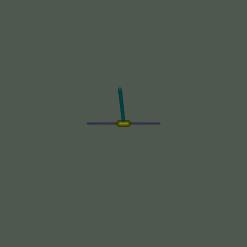
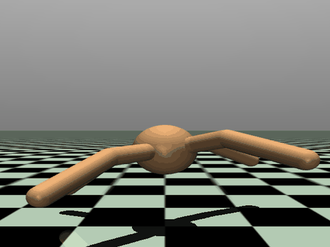

# Multi-Environment DDPG with TensorFlow-CPU

An implementation of the **Deep Deterministic Policy Gradient (DDPG)** reinforcement learning algorithm for multiple [Gymnasium](https://gymnasium.farama.org/) MuJoCo environments, built exclusively for **TensorFlow-CPU**.

## Supported Environments

| Short Name | Gymnasium ID | Task | State Dim | Action Dim | Network | Target Reward |
| :--- | :--- | :--- | :---: | :---: | :---: | :---: |
| `pendulum` | InvertedDoublePendulum-v5 | Balance a double pendulum on a cart | 9 | 1 | 256×256 | 5,000 |
| `ant` | Ant-v5 | Teach a 4-legged spider to walk | 105 | 8 | 400×300 | 2,500 |

---

## 🎬 Demonstrations

| Inverted Double Pendulum (9,357 Reward) | Ant Quadruped Locomotion (1,680+ Reward) |
| :---: | :---: |
|  |  |

---

## 🚀 Quick Start

### Train & Visualize

```bash
# Train the pendulum (fast, ~3 min on CPU)
python main.py --env pendulum --mode train

# Train the ant spider (longer, ~15-30 min on CPU)
python main.py --env ant --mode train

# Train without auto-visualization
python main.py --env ant --mode train --no-vis
```

### Visualize a Trained Agent

```bash
# Pendulum with interactive 2D Pygame viewer
python main.py --env pendulum --mode visualize --render-mode pygame

# Pendulum with 3D MuJoCo viewer
python main.py --env pendulum --mode visualize --render-mode human

# Ant spider walking (3D MuJoCo only)
python main.py --env ant --mode visualize

# With auto-perturbations
python main.py --env ant --mode visualize --auto-perturb
```

### Record a GIF

```bash
python main.py --env pendulum --mode record --gif-path pendulum_balance.gif
python main.py --env ant --mode record --gif-path ant_walking.gif
```

---

## 📁 Project Structure

```text
cartpole/
├── main.py                # Unified CLI: --env {pendulum,ant} --mode {train,visualize,record}
├── env_config.py          # Environment registry (hyperparams, network sizes, camera configs)
├── ddpg_agent.py          # DDPG Agent (Actor, Critic, Target Networks, ReplayBuffer)
├── train.py               # Training loop with auto-checkpointing & evaluation
├── visualize.py           # Real-time visual rendering & GIF export
├── requirements.txt       # Dependencies list
├── README.md              # This file
└── checkpoints/
    ├── pendulum/          # Pendulum weights & learning curve
    │   ├── best_actor.weights.h5
    │   ├── best_critic.weights.h5
    │   └── learning_curve.png
    └── ant/               # Ant weights & learning curve
        ├── best_actor.weights.h5
        ├── best_critic.weights.h5
        └── learning_curve.png
```

---

## ⚙️ Installation

```bash
pip install -r requirements.txt
```

Requires Python 3.10+, `gymnasium[mujoco]`, `tensorflow-cpu`, `numpy`, `matplotlib`, `pygame-ce`, and `imageio`.

---

## 🎮 Interactive Controls (Pendulum — Pygame Mode)

| Key | Action |
| :--- | :--- |
| <kbd>A</kbd> / <kbd>LEFT</kbd> | Push cart left |
| <kbd>D</kbd> / <kbd>RIGHT</kbd> | Push cart right |
| <kbd>W</kbd> / <kbd>UP</kbd> | Tilt pole clockwise |
| <kbd>S</kbd> / <kbd>DOWN</kbd> | Tilt pole counter-clockwise |
| <kbd>P</kbd> | Random disturbance impulse |
| <kbd>SPACE</kbd> | Pause / Resume |
| <kbd>Q</kbd> / <kbd>ESC</kbd> | Quit |

Auto-perturbations work on both environments:
```bash
python main.py --env ant --mode visualize --auto-perturb --perturb-interval 200 --perturb-magnitude 2.0
```

---

## 🧠 DDPG Architecture

### Algorithm
1. **Actor** $\mu(s|\theta^\mu)$: Maps state → deterministic continuous action via Dense → ReLU → Tanh.
2. **Critic** $Q(s, a|\theta^Q)$: Maps (state, action) → Q-value via concatenation → Dense → ReLU → Linear.
3. **Target Networks**: Soft-updated via Polyak averaging ($\tau = 0.005$).
4. **Bellman Target**: $y = r + \gamma(1 - d_{\text{terminal}}) Q'(s', \mu'(s'))$ — only bootstraps through true termination, not time-limit truncation.
5. **Exploration**: Gaussian noise $\mathcal{N}(0, \sigma)$ with exponential decay.

### Per-Environment Configuration

| Parameter | Pendulum | Ant |
| :--- | :---: | :---: |
| Actor hidden layers | 256 × 256 | 400 × 300 |
| Critic hidden layers | 256 × 256 | 400 × 300 |
| Replay buffer | 200K | 500K |
| Batch size | 128 | 256 |
| Warmup steps | 300 | 5,000 |
| Initial noise σ | 0.10 | 0.15 |
| Noise decay | 0.995 | 0.998 |
| Actor LR | 3e-4 | 1e-4 |
| Critic LR | 1e-3 | 3e-4 |

---

## 📊 Training Performance

### Inverted Double Pendulum
| Milestone | Episodes | Reward |
| :--- | :---: | :---: |
| Random exploration | 1–50 | ~40 |
| Basic coordination | 150–200 | ~250 |
| **Full balance (1000 steps)** | **~300** | **9,357** |

*~2.5 minutes on CPU.*

### Ant (Walking Spider)
| Milestone | Episodes | Reward |
| :--- | :---: | :---: |
| Random stumbling | 1–200 | < 0 |
| Early locomotion | 500–800 | ~500–1000 |
| **Consistent walking** | **~1500** | **~3000+** |

*~15–30 minutes on CPU.*

---

## 🔧 CLI Reference

```
python main.py --help

  --env {pendulum,ant}       Environment to train/visualize
  --mode {train,visualize,record}  Execution mode
  --episodes N               Max training episodes (default: env-specific)
  --target-reward R          Early stopping threshold (default: env-specific)
  --checkpoint-dir DIR       Weights directory (default: checkpoints/<env>)
  --vis-episodes N           Visualization episodes (default: 5)
  --render-mode {pygame,human}  Viewer: pygame (2D, pendulum only) or human (3D)
  --auto-perturb             Enable periodic perturbations
  --perturb-interval N       Steps between perturbations
  --perturb-magnitude F      Impulse strength
  --no-vis                   Skip visualization after training
  --fps N                    Visualization framerate
  --gif-path PATH            Output GIF path (record mode)
```
